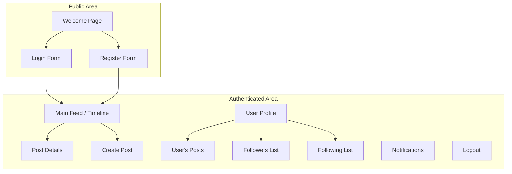

# twitter test UI/UX Specification

## Introduction

This document defines the user experience goals, information architecture, user flows, and visual design specifications for twitter test's user interface. It serves as the foundation for visual design and frontend development, ensuring a cohesive and user-centered experience.

### Overall UX Goals & Principles

#### Target User Personas

*   **社群使用者 (The Social User):** 這位使用者熟悉主流社群平台（如 Twitter）的操作。他們的核心需求是能夠輕鬆地註冊/登入、發表個人動態、與其他使用者互動（追蹤、按讚），並即時接收相關動態的通知。

#### Usability Goals

*   **直觀易用:** 使用者應能憑藉對其他社群平台的既有經驗，無需學習即可上手操作核心功能。
*   **高效互動:** 發表貼文、按讚、追蹤等核心互動應該是快速且流暢的。
*   **即時反饋:** 使用者的每個動作都應獲得即時且明確的系統回應（例如，貼文成功發佈、狀態更新的通知）。

#### Design Principles

1.  **簡潔至上 (Simplicity First):** 介面應保持乾淨、無干擾，讓使用者專注於內容的瀏覽與互動。
2.  **慣例優於創新 (Convention over Innovation):** 採用使用者所熟悉的社群平台 UI 設計模式，降低學習成本。
3.  **即時反饋 (Immediate Feedback):** 確保每個操作都有視覺上的回饋，並透過 WebSocket 提供即時的動態通知，增強互動的即時感。

---

## Information Architecture (IA)

### Site Map / Screen Inventory



### Navigation Structure

**Primary Navigation:**
使用者登入後，應有一個固定的導覽列（可能在頂部或側邊），提供以下主要連結：
*   **首頁 (Home):** 回到主動態時報。
*   **通知 (Notifications):** 查看最新的追蹤或按讚通知。
*   **個人資料 (Profile):** 前往自己的個人資料頁面。
*   **發表貼文 (Post):** 觸發建立新貼文的介面。

**Secondary Navigation:**
在個人資料頁面上，應有分頁或內部連結，用於切換查看：
*   該使用者的貼文
*   追蹤者列表
*   正在追蹤列表

**Breadcrumb Strategy:**
由於應用程式結構相對扁平，傳統的麵包屑可能不是必要的。但從「貼文詳情」或「使用者個人資料」頁面，應有清晰的路徑（例如一個 "返回" 按鈕或連結）回到前一個頁面或主動態時報。

---

## User Flows

### Create a New Post

**User Goal:** 使用者希望與他們的追蹤者分享一則簡短的文字動態。

**Entry Points:**
*   在主動態時報頁面點擊「發表貼文」按鈕。
*   在主動態時報頁面頂部的文字輸入框開始輸入。

**Success Criteria:**
*   新貼文成功發佈後，會出現在使用者自己的個人資料頁面頂部。
*   新貼文會出現在所有追蹤者的動態時報頂部。
*   使用者會看到一個成功的提示訊息（例如 "貼文已成功發佈！"）。

#### Flow Diagram
```mermaid
graph TD
    A[Start: User is on Main Feed] --> B{Click 'Post' button or<br/>focus on input field};
    B --> C[Display Post Creation Modal/UI];
    C --> D[User types content];
    D --> E{Content valid?<br/>(e.g., not empty, within char limit)};
    E -- No --> F[Show validation error message];
    F --> D;
    E -- Yes --> G[User clicks 'Submit'];
    G --> H[System processes request];
    H --> I{Post successful?};
    I -- Yes --> J[Show success message];
    J --> K[Update User's Profile Feed];
    K --> L[Push update to followers via WebSocket];
    L --> M[End: Post is live];
    I -- No --> N[Show error message];
    N --> G;
```

#### Edge Cases & Error Handling:
*   **內容為空:** 使用者點擊「送出」但未輸入任何內容時，應提示「內容不可為空」。
*   **超過字數限制:** 如果有字數限制，當使用者輸入超過時，應有即時的視覺提示，並在送出時阻止該操作。
*   **網路錯誤:** 送出時若發生網路或伺服器錯誤，應向使用者顯示一個友善的錯誤訊息，並允許他們重試。

---

## Wireframes & Mockups

**Primary Design Files:**
建議使用 [Figma](https://www.figma.com/) 或類似的設計工具來建立高保真度的視覺稿與可互動原型。所有最終的視覺設計都應集中存放在該工具的專案中，並提供連結於此。

### Key Screen Layouts

**1. Main Feed / Timeline**
*   **用途:** 顯示使用者所追蹤對象的最新貼文，是應用的核心瀏覽區域。
*   **關鍵元素:**
    *   **頂部導覽列:** 包含 Logo、首頁、通知、個人資料連結及登出按鈕。
    *   **發表新貼文元件:** 位於動態時報頂部，包含使用者頭像和一個文字輸入框，提示「有什麼新鮮事？」。
    *   **貼文列表:** 一個垂直滾動的列表，每一項包含：
        *   作者頭像與名稱
        *   貼文內容
        *   發佈時間
        *   互動按鈕 (按讚、回覆等)
*   **互動說明:**
    *   頁面應採用「無限滾動」的方式來載入舊貼文。
    *   點擊貼文應能進入該貼文的獨立詳情頁面。

**2. User Profile**
*   **用途:** 展示特定使用者的資訊、統計數據以及他們發表的所有貼文。
*   **關鍵元素:**
    *   **橫幅圖片 (Banner Image):** 位於頁面頂部。
    *   **使用者頭像 (Avatar):** 部分覆蓋在橫幅圖片上。
    *   **使用者資訊:** 名稱、帳號 ID、個人簡介。
    *   **追蹤按鈕:** 若為其他使用者的頁面，顯示「追蹤」或「取消追蹤」按鈕。
    *   **統計數據:** 正在追蹤數量、追蹤者數量。
    *   **貼文分頁:** 預設顯示該使用者發表的所有貼文列表。
*   **互動說明:**
    *   點擊「追蹤」按鈕應立即更新狀態，並向後端發送請求。

---

## Component Library / Design System

**Design System Approach:**
對於此專案，建議不建立一個完整的、獨立的設計系統，而是從一個 **專案內部的、輕量級的元件庫** 開始。這能在確保視覺一致性的同時，避免過度的前期投入。建議採用 [Tailwind CSS](https://tailwindcss.com/) 作為基礎，以快速建立自訂樣式的元件，或選用一個與 Vue 3 相容的現成元件庫（如 [Element Plus](https://element-plus.org/) 或 [Vuetify](https://vuetifyjs.com/)）來加速開發。

### Core Components

**1. Button**
*   **用途:** 用於所有可點擊的操作，如送出表單、追蹤使用者等。
*   **變體 (Variants):**
    *   `Primary`: 用於主要操作 (例如「發表貼文」、「登入」)。
    *   `Secondary`: 用於次要操作 (例如「取消」)。
    *   `Destructive`: 用於危險操作 (例如「刪除貼文」)。
*   **狀態 (States):** `default`, `hover`, `focus`, `disabled`。

**2. Input Field**
*   **用途:** 用於所有使用者輸入，包括登入/註冊表單、發表貼文的文字區域。
*   **變體 (Variants):**
    *   `Text Input`: 單行文字輸入。
    *   `Text Area`: 多行文字輸入（用於發表貼文）。
*   **狀態 (States):** `default`, `focus`, `error` (驗證失敗時)。

**3. Avatar**
*   **用途:** 顯示使用者個人資料圖片。
*   **變體 (Variants):**
    *   `Small`: 用於動態時報的貼文旁。
    *   `Large`: 用於使用者個人資料頁面。

**4. Post Card**
*   **用途:** 在動態時報中，作為單則貼文的容器。
*   **結構:** 包含頭像、使用者名稱、貼文內容、發佈時間及互動按鈕 (按讚)。

---

## Branding & Style Guide

### Visual Identity
*   **品牌指南:** 由於這是一個新專案，目前尚無正式的品牌指南。本文件將定義初步的視覺風格，目標是建立一個現代、乾淨且值得信賴的形象。

### Color Palette

| 顏色類型 | Hex 色碼 | 用途 |
| :--- | :--- | :--- |
| **主要色 (Primary)** | `#1D9BF0` | 主要按鈕、連結、焦點狀態、核心品牌元素 |
| **次要色 (Secondary)**| `#EFF3F4` | 次要按鈕、背景高亮 |
| **成功色 (Success)** | `#00BA7C` | 成功訊息、確認提示 |
| **警告色 (Warning)** | `#FFD400` | 提醒、需要注意的資訊 |
| **錯誤色 (Error)** | `#F91880` | 錯誤訊息、危險操作 |
| **中性色 (Neutral)** | `#0F1419` (主要文字), `#536471` (次要文字), `#CFD9DE` (邊框), `#F6F8FA` (背景) | 文字、邊框、背景 |

### Typography

*   **字體家族 (Font Families):**
    *   **主要:** 採用系統預設的 UI 字體，以獲得最佳的效能與平台一致性 (`system-ui, -apple-system, BlinkMacSystemFont, "Segoe UI", Roboto, "Helvetica Neue", Arial, sans-serif`)。
*   **字體層級 (Type Scale):**
    | 元素 | 字體大小 | 字重 | 行高 |
    | :--- | :--- | :--- | :--- |
    | H1 | `2rem` (32px) | Bold | 1.2 |
    | H2 | `1.5rem` (24px) | Bold | 1.3 |
    | H3 | `1.25rem` (20px)| Bold | 1.4 |
    | Body | `1rem` (16px) | Regular | 1.5 |
    | Small| `0.875rem` (14px)| Regular | 1.5 |

### Iconography
*   **圖示庫:** 推薦使用 [Heroicons](https://heroicons.com/)，它提供了一致的、現代化的圖示集，並有 `Outline` 和 `Solid` 兩種風格。
*   **使用指南:**
    *   一般狀態下使用 `Outline` (線框) 風格的圖示。
    *   在圖示被選中或處於啟用狀態時，使用 `Solid` (實心) 風格以提供清晰的視覺回饋。

### Spacing & Layout
*   **格線系統:** 建議使用標準的 12 欄格線系統來組織頁面佈局。
*   **間距單位:** 採用以 4px 為基數的間距系統 (`1 unit = 4px`)。所有的 `padding`、`margin` 和 `gap` 都應為 4 的倍數（例如 `4px, 8px, 12px, 16px, 24px`），以確保佈局的視覺和諧與一致性。

---

## Accessibility Requirements

### Compliance Target
*   **標準:** 本專案的目標是符合 **Web Content Accessibility Guidelines (WCAG) 2.1 Level AA** 的標準。這是業界公認的、能為絕大多數使用者提供良好體驗的通用標準。

### Key Requirements

*   **視覺 (Visual):**
    *   **色彩對比:** 一般文字與背景的對比度至少為 **4.5:1**；較大尺寸的文字（18pt 或 14pt 粗體以上）對比度至少為 **3:1**。
    *   **焦點指示:** 所有可互動的元素（連結、按鈕、輸入框）在透過鍵盤取得焦點時，都必須有清晰可見的視覺外框。
    *   **文字縮放:** 使用者應能夠在瀏覽器中將頁面文字放大至 200% 而不會破壞版面或導致功能喪失。

*   **互動 (Interaction):**
    *   **鍵盤導覽:** 網站的所有功能都必須能僅透過鍵盤來操作，且焦點移動的順序必須合乎 logique。
    *   **螢幕閱讀器支援:** 所有內容與互動元件都應能被螢幕閱讀器正確地解讀。應適當使用 ARIA 屬性來增強語意。
    *   **觸控目標:** 在觸控螢幕上，所有可點擊的目標區域尺寸不應小於 44x44 CSS 像素，以方便點擊。

*   **內容 (Content):**
    *   **替代文字:** 所有具有資訊傳達功能的圖片都必須提供有意義的 `alt` 替代文字。裝飾性的圖片 `alt` 屬性應留空。
    *   **標題結構:** 應使用 `<h1>` 到 `<h6>` 標籤來建立邏輯清晰的文件層級結構，不可跳級使用。
    *   **表單標籤:** 所有的表單輸入元件都必須有與之程式化關聯的 `<label>` 標籤。

### Testing Strategy
將採用混合測試策略：
1.  **自動化測試:** 在開發流程中整合如 [Axe](https://www.deque.com/axe/) 或 [Lighthouse](https://developer.chrome.com/docs/lighthouse/) 等工具，進行初步掃描。
2.  **手動測試:** 定期進行純鍵盤操作測試與主流螢幕閱讀器（如 NVDA, VoiceOver）的測試。
3.  **使用者測試:** 在可能的情況下，邀請有特殊需求的真實使用者參與測試，以獲得最直接的回饋。

---

## Responsiveness Strategy

### Breakpoints

| 中斷點 | 最小寬度 | 目標裝置 |
| :--- | :--- | :--- |
| **Mobile (行動裝置)** | 320px | Smartphones (直向) |
| **Tablet (平板電腦)** | 768px | Tablets (直向), larger smartphones |
| **Desktop (桌面電腦)** | 1024px | Laptops, standard desktop monitors |
| **Wide (寬螢幕)** | 1280px | Large or high-resolution monitors |

*註：設計應採用「行動裝置優先」(Mobile-First) 的原則，從最小的螢幕尺寸開始設計，再逐步擴展到較大的螢幕。*

### Adaptation Patterns

*   **版面配置變更 (Layout Changes):**
    *   **行動裝置:** 採用單欄式佈局，將所有內容垂直堆疊，確保可讀性與易用性。
    *   **平板電腦以上:** 可採用雙欄式佈局，例如左側為主動態時報，右側為趨勢或建議追蹤的用戶。
*   **導覽變更 (Navigation Changes):**
    *   **行動裝置/平板電腦:** 主要導覽列將收合到一個「漢堡選單」圖示中，以節省螢幕空間。
    *   **桌面電腦:** 完整顯示主要導覽列的連結。
*   **內容優先級 (Content Priority):**
    *   在較小的螢幕上，應優先顯示核心內容（動態時報）。次要資訊（如頁尾連結、額外資訊面板）可能會被隱藏或移至選單內。
*   **互動變更 (Interaction Changes):**
    *   為觸控螢幕優化，確保按鈕和連結的觸控目標區域足夠大。
    *   滑鼠懸停 (hover) 效果在觸控螢幕上將不適用，需確保重要的互動提示有其他觸發方式（如點擊後顯示）。

---

## Animation & Micro-interactions

### Motion Principles
動畫的目的是為了 **引導、反饋與增添活力**，而非單純的裝飾。所有動畫都應遵循以下原則：
1.  **快速且有目的 (Fast & Purposeful):** 動畫應該要快，通常在 150ms 至 300ms 之間完成，以免讓使用者感到等待。
2.  **流暢自然 (Smooth & Natural):** 使用 `ease-in-out` 或 `ease-out` 等缓動函式，模擬真實世界的物理動態，避免生硬的線性運動。
3.  **提供資訊 (Informative):** 動畫應該能幫助使用者理解介面中發生的變化，例如元素的出現、消失或狀態轉變。

### Key Animations

*   **按讚互動 (Like Interaction):**
    *   **描述:** 當使用者點擊「按讚」按鈕時，愛心圖示會快速地從線框變為實心填滿，並伴隨一個輕微的放大再縮小的彈跳效果，給予使用者即時且愉悅的確認感。
    *   **時長:** ~200ms
    *   **缓動:** `ease-out`

*   **按鈕懸停 (Button Hover):**
    *   **描述:** 當滑鼠懸停在主要按鈕上時，按鈕背景色會平滑地過渡到一個稍亮或稍暗的色調，提供明確的可互動提示。
    *   **時長:** ~150ms
    *   **缓動:** `ease-in-out`

*   **新貼文出現 (New Post Appearance):**
    *   **描述:** 當有新的貼文載入到動態時報頂部時，它會以一個輕微的淡入 (fade-in) 和向下滑動 (slide-down) 的效果出現，溫和地引導使用者的注意力，而不是突然地跳出。
    *   **時長:** ~300ms
    *   **缓動:** `ease-out`

*   **載入指示 (Loading Indicator):**
    *   **描述:** 在等待載入更多貼文或提交資料時，使用一個輕柔的、持續旋轉的圓圈或脈衝動畫，告知使用者系統正在處理中。

---

## Performance Considerations

### Performance Goals
效能是使用者體驗的基石。我們的目標是：
*   **頁面載入 (Page Load):** 核心頁面（如動態時報）的 **首次內容繪製 (First Contentful Paint, FCP)** 時間應在 **1.8 秒** 以內。
*   **互動回應 (Interaction Response):** 對於使用者的輸入（如點擊、捲動），介面應在 **100 毫秒** 內給予回應。
*   **動畫影格率 (Animation FPS):** 所有介面動畫應穩定維持在 **60 FPS**，以確保流暢無卡頓的視覺體驗。

### Design Strategies that Impact UX
為了達成上述目標，在設計階段就應考慮以下策略：
*   **圖片優化 (Image Optimization):** 使用者上傳的頭像或圖片應在後端自動壓縮，並在前端提供 `webp` 等現代格式。動態時報中的圖片應採用 **延遲載入 (Lazy Loading)**，只有當圖片即將進入可視區域時才開始載入。
*   **虛擬化列表 (Virtualized Lists):** 對於可能包含數百則貼文的動態時報，應採用 **虛擬捲動 (Virtual Scrolling)** 技術。這項技術只渲染畫面可視範圍內的貼文 DOM 元素，極大地提升了長列表的渲染效能與記憶體使用效率。
*   **骨架屏 (Skeleton Screens):** 在等待動態時報內容載入時，顯示一個與真實 UI 佈局相似的「骨架」佔位符，這能有效降低使用者感知的等待時間。
*   **動畫效能 (Animation Performance):** 優先使用硬體加速的 CSS 屬性 (`transform`, `opacity`) 來製作動畫，避免使用會導致重繪 (repaint) 和重排 (reflow) 的屬性 (如 `width`, `height`, `top`, `left`)。

---

## Next Steps

### Immediate Actions
1.  **儲存文件:** 我會將這份完整的前端規格文件儲存至 `docs/front-end-spec.md`。
2.  ** stakeholder 審核:** 建議將此文件分享給專案的相關人員（如產品經理、後端開發者）進行審核，以確保大家對前端的願景有一致的理解。
3.  **建立視覺設計稿:** 根據此文件，下一步是在 Figma 等專業設計工具中開始建立高保真度的視覺稿與可互動原型。
4.  **前端架構設計:** 將此文件交付給前端架構師，作為規劃技術選型、專案結構和元件策略的基礎。

### Design Handoff Checklist
在將設計交付給開發團隊之前，請確保以下項目已完成：
- [x] 所有核心使用者流程皆已文件化
- [x] 元件庫的核心元件已定義
- [x] 無障礙設計需求已明確
- [x] 響應式策略已清晰
- [x] 品牌與風格指南已建立
- [x] 效能目標已設定
